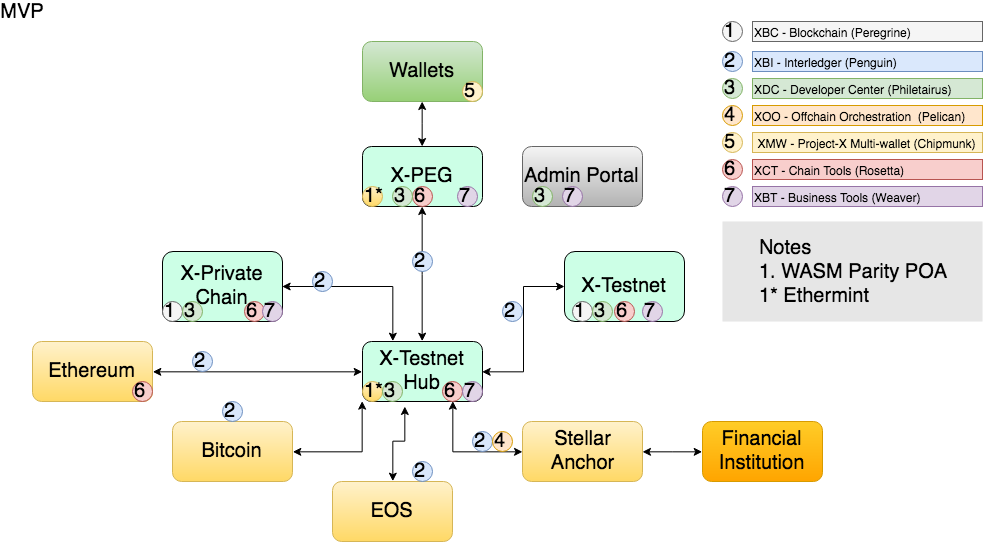

# Overview
This document gives an overview of the tools needed to develop and build in the Jincubator environment.

# Architecture

## Technology Breakdown

* User Interface is written in React
* Persistence Layer is MySQL or Firebase
* API Layer is written in Go or Node or Rust
* Wallets use MetaMask, Atomic Wallet or KeyBase
* BlockChains
  * Full Nodes
    * Peggy (Ethermint/Tendermint)
    * Hub  (Ethermint/Tendermint)
    * Testnet (Parity POA)
    * Private-chain (Parity POA)
  * Light Clients
    * Ethereum Testnet
    * Bitcoin
    * EOS
    * Stellar
* Offchain Orchestration - similar to ChainLink but enhanced
* Blockchain Governance - similar to RocketPool
* ChainCode is written in Solidity, Vyper, Go or Rust
  * ChainCode Examples
    * Ethereum Standards 
    * Stable Coins
    * Liquidity
    * Pegging
    * Governance
    * Digital Assets
* Distributed Virtuam Machines are EVM or WASM
* Deployment tools - Docker, Kubernetes and Helm
* Cloud Service Provider - Google Cloud Platform or AWS
* CICD - Travis
* Documentation Gitbook

## Technology Partners

* Stellar
* Tendermint
* Cosomos
* Trust Providers
* Hosting Partners
* KYC
* Payment Platforms
* Stable Coins
* Wallets

## Future Functionality

* Middleware - Offchain Orchestration
* PAAS - Deployment and hosting of Private Chains
* Analytics
* Monitoring
* Business Object Templating
* Business Process Modelling
* Connector Suite
* InterPlatform Communication Standards

